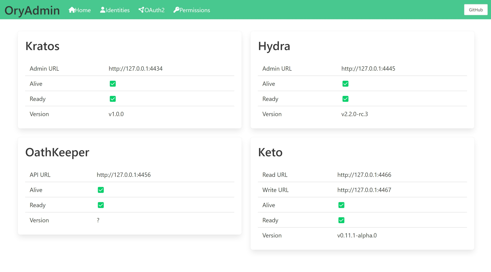
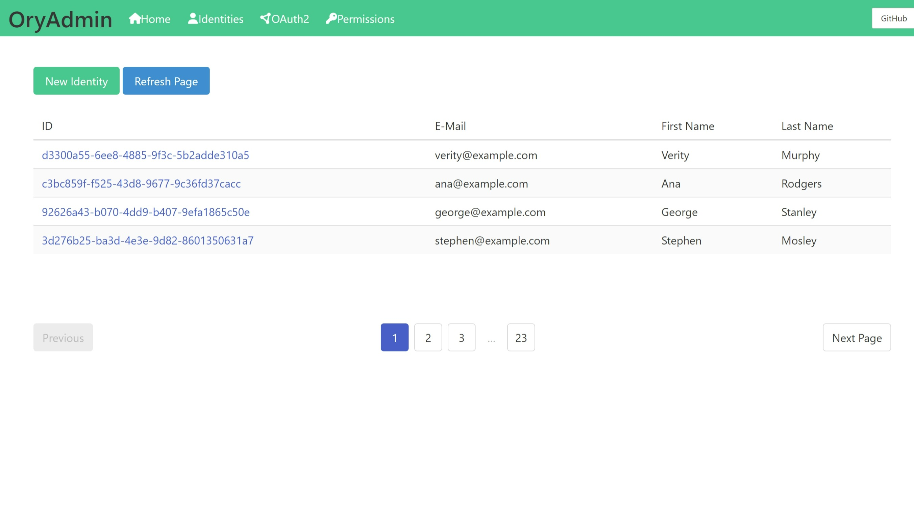
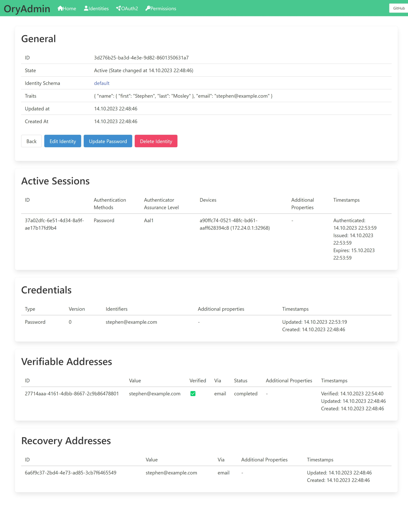

# OryUI - Ory User Interfaces

> This project is currently under early development.

OryUI provides user interfaces for the [Ory](https://www.ory.sh/) APIs. Ory is a 
[FOSS solution](https://www.ory.sh/open-source/) for authentication, authorization, access control, and delegation.

The Ory stack consists of the following services:
1. [Ory Kratos](https://www.ory.sh/kratos/): "Cloud native user management system. Provision IDs, store user 
information, configure authentication methods and use a headless API."
2. [Ory Hydra](https://www.ory.sh/hydra/): "OAuth 2.0 and OpenID Certified® OpenID Connect server. Cloud native, 
security-first, headless API security for your infrastructure."
3. [Ory OathKeeper](https://www.ory.sh/oathkeeper/): "Cloud native user management system. Provision IDs, store 
user information, configure authentication methods and use a headless API."
4. [Ory Keto](https://www.ory.sh/keto/): "Authorization Server inspired by Google's consistent, global 
Authorization System, providing granular access policies with RBAC, ABAC and ACL."


## Projects

### Ory Admin UI
OryAdmin is intended to be an administrative interface for the Ory services and located in the 
[/OryAdmin](/OryAdmin) directory. It is inspired by the [kratos-admin-ui](https://github.com/dfoxg/kratos-admin-ui) project.





#### Features
- Ory Kratos
  - View identities
  - View identity with active sessions
  - Delete identity
  - Update password / account recovery
  - Create identity
  - Edit identity
- Ory Hydra
  - View JSON Web Key Sets
- Ory Keto
  - View namespaces and relationships

#### Tested with the following versions
Other versions may work (partially) too but haven't been tested.

| Service        | Version |
|----------------|---------|
| Ory Kratos     | `v1.0`  |
| Ory Hydra      | `v2.2`  |
| Ory OathKeeper | `v0.40` |
| Ory Keto       | `v0.11` |

### Ory Kratos Self Service UI
KratosSelfService aims to be a drop-in replacement for the [kratos-selfservice-ui-node](https://github.com/ory/kratos-selfservice-ui-node) and is located in 
the [/KratosSelfService](/KratosSelfService) directory.

- [x] Login
- [x] Registration
- [x] Verify Email
- [x] Account Settings
- [x] Logout
- [x] Error Page
- [x] Recovery
- [x] Sessions

## Get Started
### 1. Preparation
#### Required software
- asp.net version 8
- docker
- docker compose

#### Clone the project
```bash
git clone https://github.com/josxha/Oryon.git
```

### 2. Start the Ory services
Run Ory locally by running the [/ory/docker-compose.yml](ory/docker-compose.yml) file. Ory will store its data 
persistently in SqLite databases. 
```bash
docker network create ory
cd ./ory
docker compose up -d 
```

### 3. Start the UI
```bash
dotnet run --project ./OryAdmin
dotnet run --project ./KratosSelfService
```
