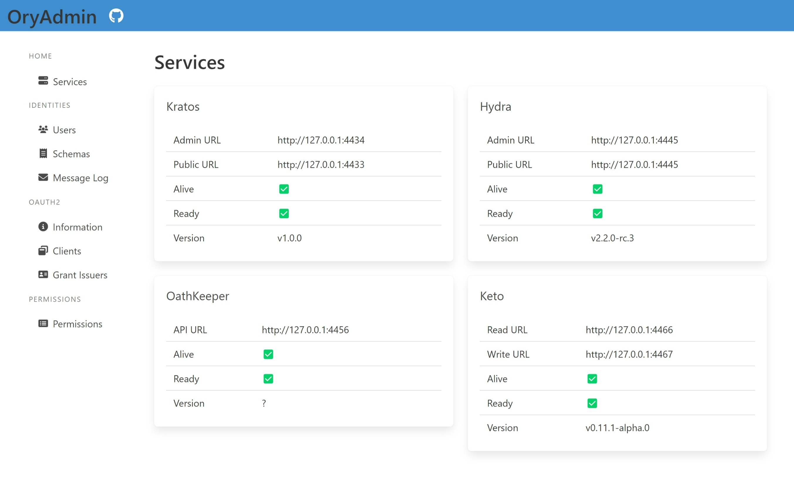
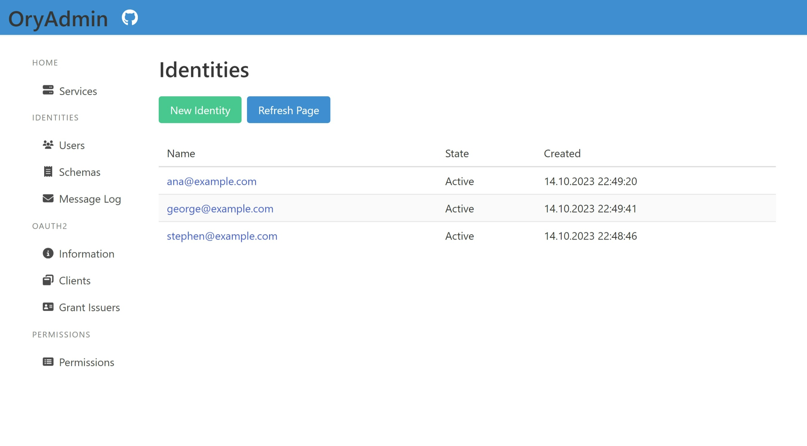
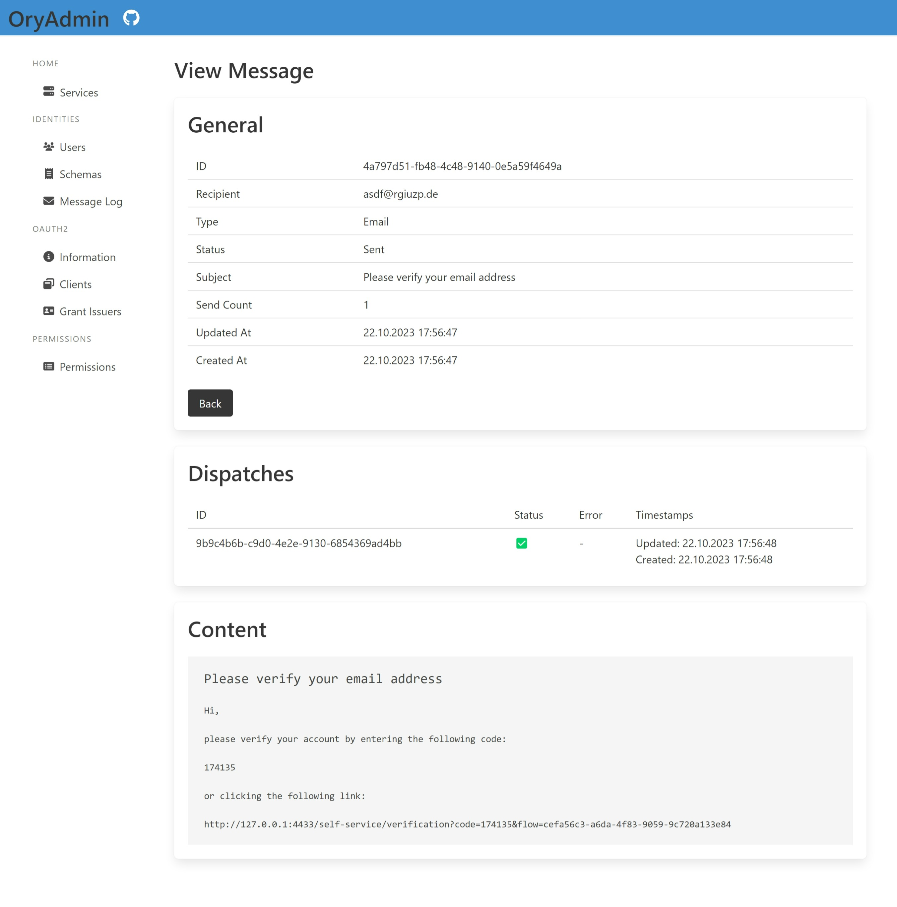
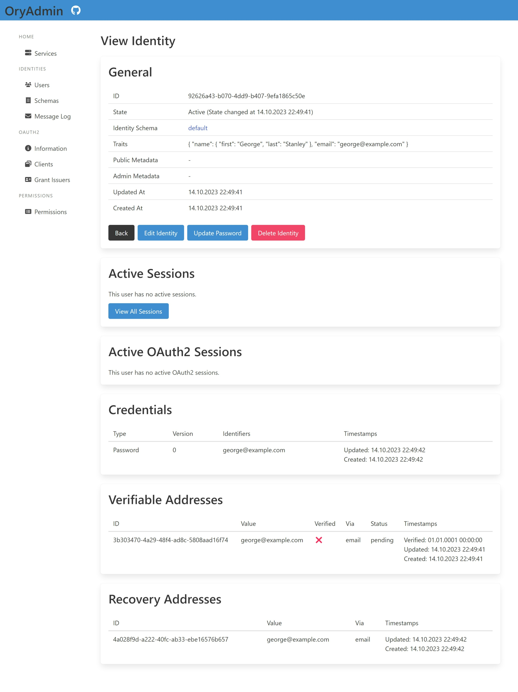
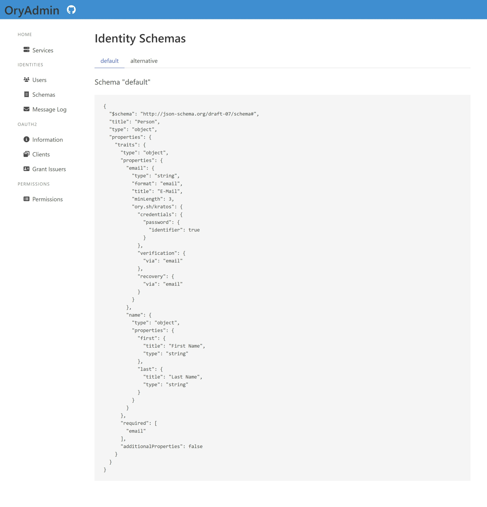
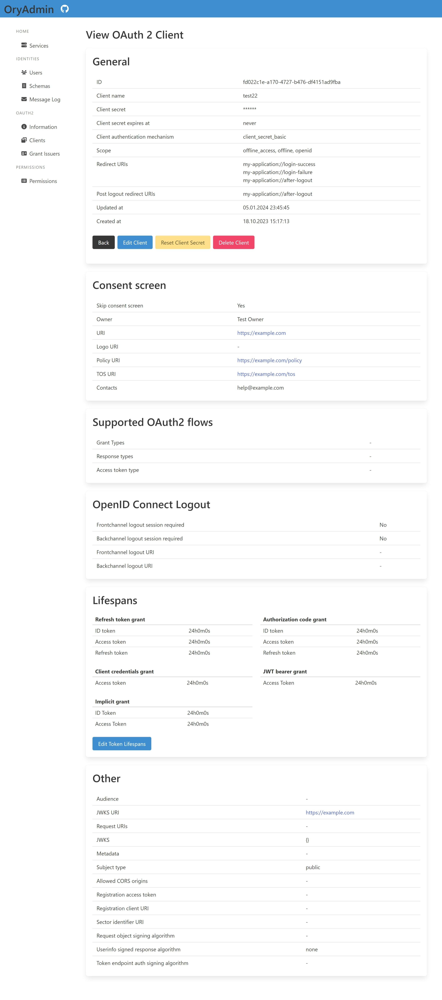
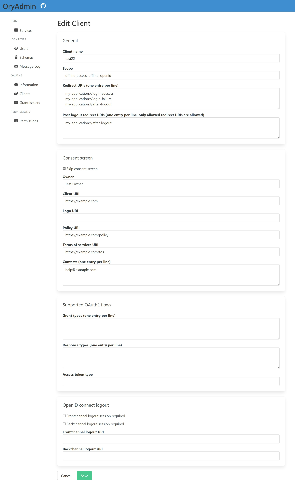

# OryUI - ORY User Interfaces
[](https://github.com/josxha/OryUI/stargazers)
[](https://github.com/josxha/OryUI)
[](https://github.com/josxha/OryUI/issues)
[](https://GitHub.com/josxha/OryUI/pulls)


#### This project is not affiliated with ORY Corp in any way.

- [What is Ory](#what-is-ory)
- [Projects](#projects)
    - [ORY Admin UI](#ory-admin-ui)
    - [ORY Kratos Self Service UI](#ory-kratos-self-service-ui)
- [Get started](#get-started)

## What is Ory

OryUI provides user interfaces for the [Ory](https://www.ory.sh/) APIs. ORY is a
[FOSS solution](https://www.ory.sh/open-source/) for authentication, authorization, access control, and delegation.

The ORY stack consists of the following services:

<table>
<tr>
<td>
<a target="_blank" href="https://www.ory.sh/kratos/">ORY Kratos</a>: "Cloud native user management system. Provision IDs, store user 
information, configure authentication methods and use a headless API."
</td>
<td>
<a target="_blank" href="https://www.ory.sh/hydra/">ORY Hydra</a>: "OAuth 2.0 and OpenID Certified® OpenID Connect server. Cloud native, 
security-first, headless API security for your infrastructure."
</td>
</tr>
<tr>
<td>
<a target="_blank" href="https://www.ory.sh/oathkeeper/">ORY OathKeeper</a>: "Cloud native user management system. Provision IDs, store 
user information, configure authentication methods and use a headless API."
</td>
<td>
<a target="_blank" href="https://www.ory.sh/keto/">ORY Keto</a>: "Authorization Server inspired by Google's consistent, global 
Authorization System, providing granular access policies with RBAC, ABAC and ACL."
</td>
</tr>
</table>

## Projects

### ORY Admin UI

OryAdmin is intended to be an administrative interface for the ORY services and located in the
[/OryAdmin](/OryAdmin) directory. It is inspired by the [kratos-admin-ui](https://github.com/dfoxg/kratos-admin-ui)
project.

#### Features

- ORY Kratos
    - View identities
    - View identity with its active sessions
    - View active and inactive sessions of an identity
    - Create, edit and delete an identity
    - Update password / account recovery
- ORY Hydra
    - View JSON Web Key Sets
    - View client
    - Create, edit and delete a client
    - Reset the client secret
- ORY Keto
    - View namespaces and relationships

#### Service Dashboard

<table>
<tr>
<td></td>
</tr>
</table>

#### ORY Kratos Integration

<table>
<tr>
<th>Identity users</th>
<th>View message</th>
</tr>
<tr>
<td></td>
<td></td>
</tr>
<tr>
<th>View identity</th>
<th>Identity schemas</th>
</tr>
<tr>
<td></td>
<td></td>
</tr>
</table>

#### ORY Hydra Integration

<table>
<tr>
<th>View OAuth2 client</th>
<th>Edit OAuth2 client</th>
</tr>
<tr>
<td></td>
<td></td>
</tr>
</table>

#### Developed with the following versions

Other versions may work too but haven't been tested.

| Kratos | Hydra  | OathKeeper | Keto    |
|--------|--------|------------|---------|
| `v1.1` | `v2.2` | `v0.40`    | `v0.12` |

### ORY Kratos Self Service UI

KratosSelfService aims to be a drop-in replacement for
the [kratos-selfservice-ui-node](https://github.com/ory/kratos-selfservice-ui-node) and is located in
the [/KratosSelfService](/KratosSelfService) directory.

- [x] Login
- [x] Registration
- [x] Verify Email
- [x] Account Settings
- [x] Logout
- [x] Error Page
- [x] Recovery
- [x] Sessions
- [x] OAuth2 Consent Page

## Get started

You can either run the ORY UI projects standalone or run it inside of docker containers.

### Run containerized with Docker

There are prebuilt container images:

```bash
docker pull ghcr.io/josxha/ory_admin:latest
docker pull ghcr.io/josxha/kratos_self_service:latest
```

Check out the [./docker-compose.yml](https://github.com/josxha/OryUI/blob/main/docker-compose.yml) file for the usage.

### Run standalone

1. Install the required
   software: [asp.net version 8](https://learn.microsoft.com/de-de/dotnet/core/install/windows), [Docker](https://docs.docker.com/engine/install/)
   and [docker-compose](https://docs.docker.com/compose/install/)
2. Clone the repository

```bash
git clone https://github.com/josxha/OryUI.git
```

3. Start the ORY services: Run ORY locally by using the [/ory-services/docker-compose.yml](ory-services/docker-compose.yml) file. ORY will
   store its data
   persistently in SqLite databases:

```bash
docker network create ory
cd ./ory-services
docker compose up -d 
```

4. Start the UI

```bash
dotnet run --project ./OryAdmin
dotnet run --project ./KratosSelfService
```
